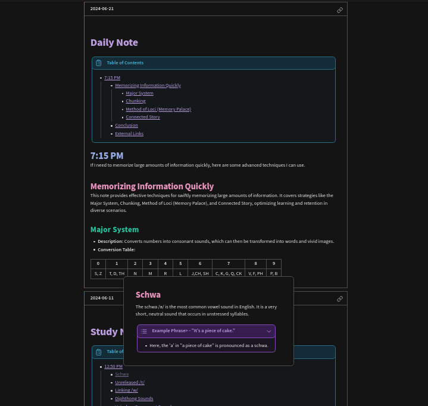
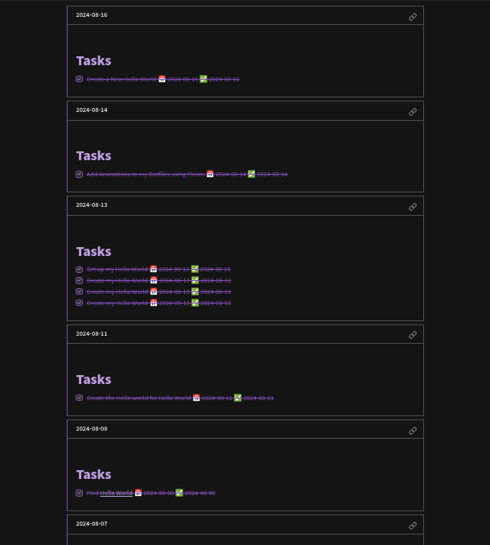
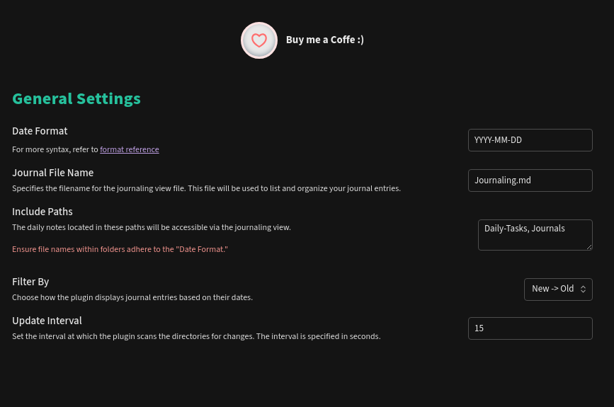

# Journaling for Obsidian

## Description

View daily notes in a journal-like format, similar to Logseq. It enhances note organization and facilitates better reflection by consolidating daily notes into a continuous journaling view.

## Examples

## Features

- **Journaling View**: Displays daily notes in a continuous journal format, making it easier to review past entries.
- **Multiple Paths Support**: Users can specify multiple directories to be included in the journaling view.
- **Customizable Date Format**: Users can define the date format of their notes, enabling compatibility with various formats (e.g., `YYYY-MM-DD`, `MM-DD-YYYY`).
- **File Name Customization**: The journaling view can be tied to a specific file name defined by the user.
- **Filter by Date**: Sort and filter entries by date, with options for "newest first" or "oldest first."
- **Configurable Update Interval**: Users can set how frequently the journaling view updates to reflect changes in their files.

## Installation

1. Download or clone this repository into your Obsidian plugins folder.
2. In Obsidian, enable the plugin in the "Community Plugins" section of the settings.
3. Configure the plugin according to your preferences in the settings tab.

## Usage

The plugin will automatically scan the specified directories and consolidate all markdown files that follow the date format into the journaling view.

## Settings

- **Date Format**: Choose a date format that matches the naming convention of your daily notes.
- **Journal File Name**: Specify the name of the journaling file where entries will be consolidated.
- **Include Paths**: Add one or more directories that you want to include in the journaling view.
- **Filter By**: Decide whether to display the newest or oldest entries first.
- **Update Interval**: Set how frequently (in seconds) the plugin should check for new or modified files.

## Contributing

If you encounter any issues or have suggestions for improvements, feel free to open an issue or submit a pull request. Contributions are welcome!

## License

This plugin is available under the [MIT License](LICENSE). Feel free to modify
and use it to create your own Obsidian plugins.
